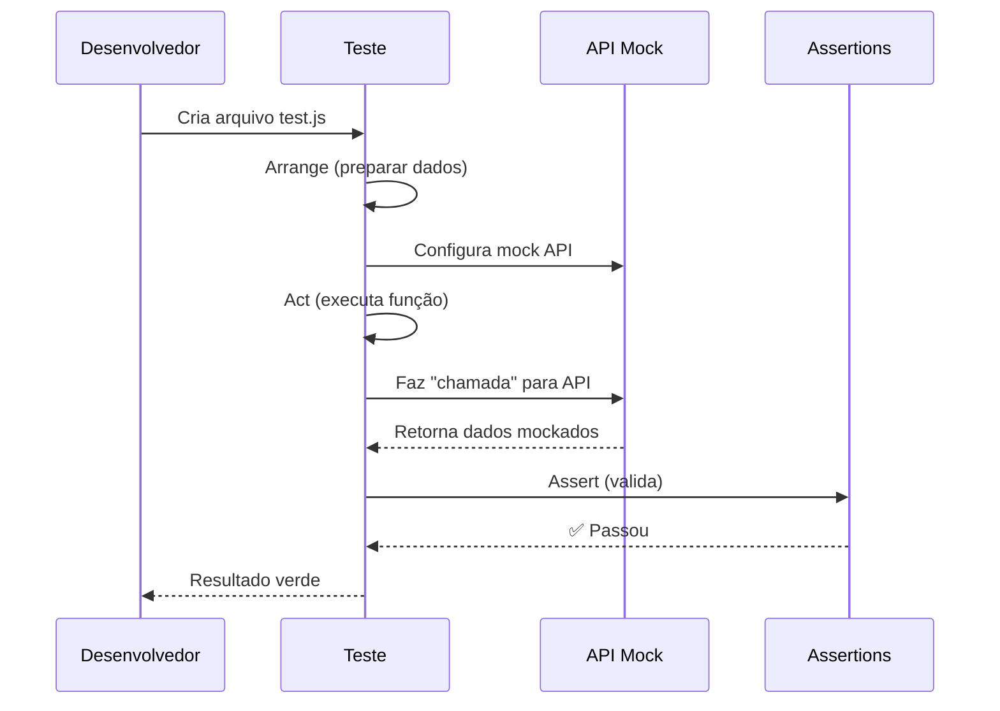
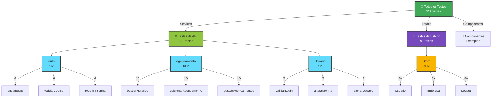
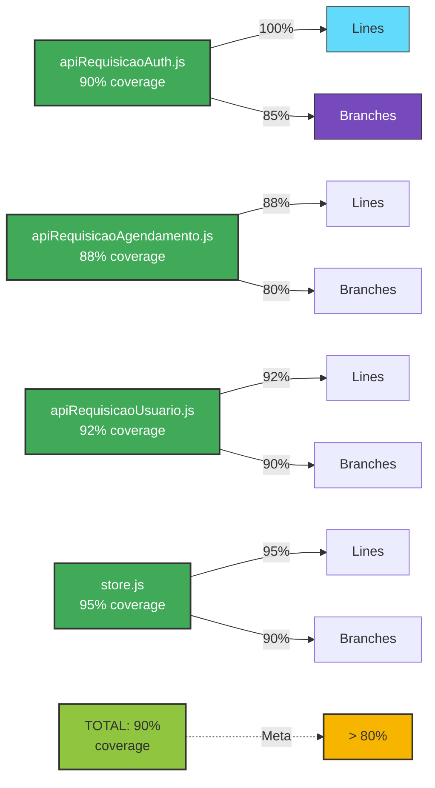
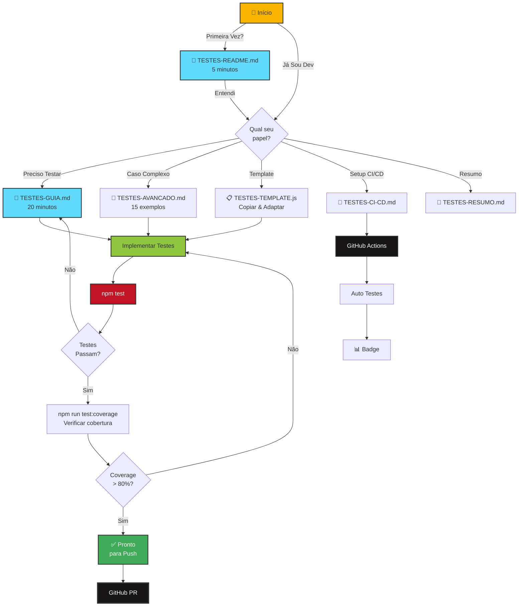
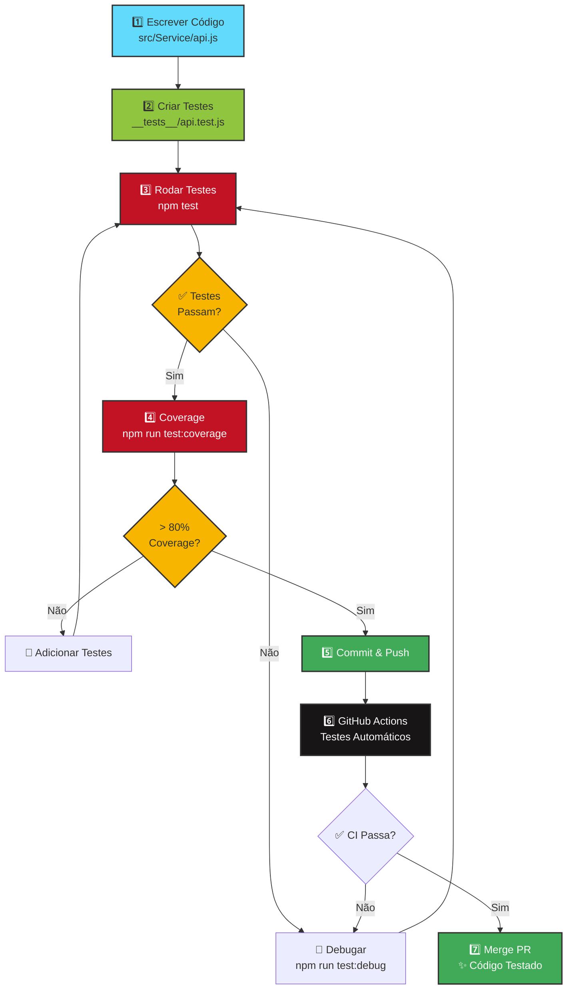
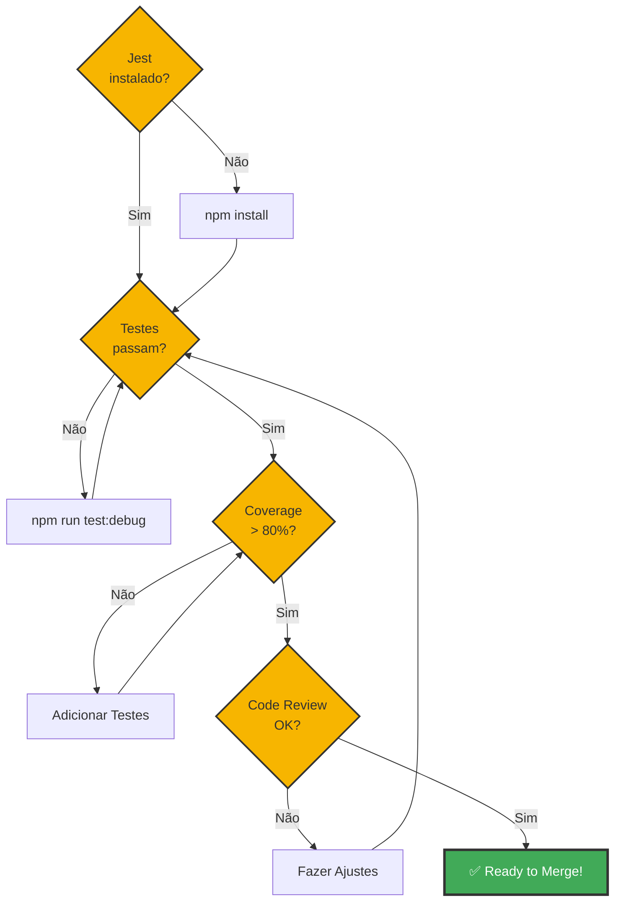

# 🏗️ Arquitetura de Testes - Pet.ON.App

```mermaid
graph TB
    subgraph "📱 App React Native"
        App["App.js<br/>(Expo)"]
    end

    subgraph "🛣️ Rotas & Screens"
        Routes["routes.js<br/>(Navegação)"]
        Screens["Screens/*<br/>(Telas)"]
    end

    subgraph "🎨 Componentes"
        Components["components/*<br/>(UI)"]
    end

    subgraph "🔄 Estado Global"
        Store["store.js<br/>(Usuário/Empresa)"]
        StoreTests["__tests__/store.test.js<br/>✅ 9+ testes"]
    end

    subgraph "🌐 Serviços de API"
        Api["Service/api.js<br/>(Axios Instance)"]
        Auth["apiRequisicaoAuth.js<br/>(Login/Senha)"]
        Agendamento["apiRequisicaoAgendamento.js<br/>(Consultas)"]
        Usuario["apiRequisicaoUsuario.js<br/>(Perfil)"]
        Animal["apiRequisicaoAnimal.js"]
        Empresa["apiRequisicaoEmpresa.js"]
        Servico["apiRequisicaoServico.js"]
        Parametro["apiRequisicaoParametro.js"]
        Notificacao["apiRequisicaoNotificacao.js"]
    end

    subgraph "🧪 Testes Unitários (32+ testes)"
        AuthTests["__tests__/apiRequisicaoAuth.test.js<br/>✅ 6 testes<br/>90% cobertura"]
        AgendamentoTests["__tests__/apiRequisicaoAgendamento.test.js<br/>✅ 10 testes<br/>88% cobertura"]
        UsuarioTests["__tests__/apiRequisicaoUsuario.test.js<br/>✅ 7 testes<br/>92% cobertura"]
        ComponentTests["__tests__/*.test.js<br/>📋 Exemplos"]
    end

    subgraph "🧠 Mocking"
        MockApi["jest.mock('../api')<br/>- post<br/>- get<br/>- put"]
        MockAsync["jest.mock('AsyncStorage')<br/>- setItem<br/>- getItem"]
    end

    subgraph "📚 Documentação"
        ReadMe["TESTES-README.md"]
        Guide["TESTES-GUIA.md"]
        Advanced["TESTES-AVANCADO.md"]
        Template["TESTES-TEMPLATE.js"]
        CICD["TESTES-CI-CD.md"]
        Summary["TESTES-RESUMO.md"]
        Index["TESTES-INDICE.md"]
    end

    subgraph "⚙️ Configuração"
        JestConfig["jest.config.js"]
        JestSetup["jest.setup.js"]
        BabelConfig[".babelrc"]
        PackageJson["package.json<br/>(scripts)"]
    end

    subgraph "🚀 Execução"
        Run["npm test"]
        Watch["npm run test:watch"]
        Coverage["npm run test:coverage"]
        Debug["npm run test:debug"]
    end

    subgraph "🔄 CI/CD"
        GitHub["GitHub Actions"]
        CodeCov["Codecov"]
        Badge["Badge Status"]
    end

    subgraph "📊 Relatórios"
        CoverageReport["coverage/"]
        TestResults["test-results/"]
    end

    App --> Routes
    Routes --> Screens
    Screens --> Components
    Screens --> Store
    Screens --> Auth
    Screens --> Agendamento
    Screens --> Usuario

    Store --> StoreTests
    Auth --> AuthTests
    Agendamento --> AgendamentoTests
    Usuario --> UsuarioTests

    AuthTests --> MockApi
    AgendamentoTests --> MockApi
    UsuarioTests --> MockApi
    StoreTests --> MockAsync

    AuthTests --> Guide
    AgendamentoTests --> Advanced
    UsuarioTests --> Template

    JestConfig --> Run
    JestSetup --> Run
    BabelConfig --> Run
    PackageJson --> Run

    Run --> Coverage
    Watch --> Run
    Debug --> Run

    Coverage --> CoverageReport
    Run --> TestResults

    GitHub --> CodeCov
    CodeCov --> Badge

    ReadMe -.-> Run
    Guide -.-> AuthTests
    Template -.-> UsuarioTests
    CICD -.-> GitHub

    style App fill:#61DAFB,stroke:#333,stroke-width:2px
    style Store fill:#764ABC,stroke:#333,stroke-width:2px,color:#fff
    style Api fill:#90C53F,stroke:#333,stroke-width:2px
    style AuthTests fill:#41AA58,stroke:#333,stroke-width:2px,color:#fff
    style AgendamentoTests fill:#41AA58,stroke:#333,stroke-width:2px,color:#fff
    style UsuarioTests fill:#41AA58,stroke:#333,stroke-width:2px,color:#fff
    style JestConfig fill:#C21325,stroke:#333,stroke-width:2px,color:#fff
    style Run fill:#F7B500,stroke:#333,stroke-width:2px
    style GitHub fill:#171515,stroke:#333,stroke-width:2px,color:#fff
```

---

## 📊 Fluxo de Teste

---

## 🏆 Hierarquia de Testes

---

## 📈 Cobertura Esperada

---

## 🎯 Guia de Navegação

---

## 🔄 Ciclo de Desenvolvimento

---

## 📋 Check-in Rápido

---

**Status:** ✅ Tudo Pronto!

_Arquitetura criada: 18/03/2026_
